[🇷🇺 Русский](./README.md) | **🇬🇧 English**

---

<div align="center">
  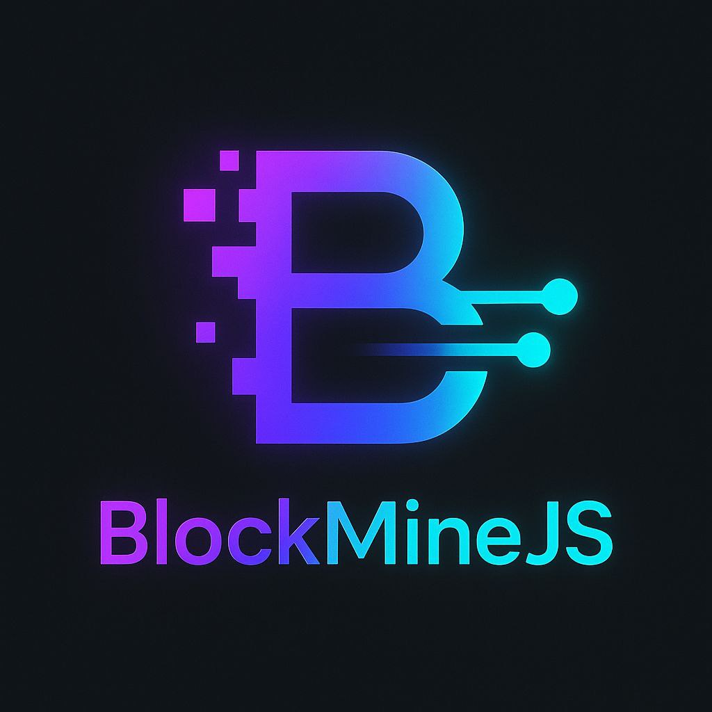
  <h1>BlockMine</h1>
  <p>
    <strong>Powerful Minecraft bot management platform with visual programming and advanced debugging</strong>
  </p>
  <p>
    <a href="https://github.com/blockmineJS/blockmine/stargazers"></a>
    <a href="https://github.com/blockmineJS/blockmine/commits/main"></a>
    <a href="http://185.65.200.184:3000/api/stats" target="_blank">
      
    </a>
  </p>
</div>

**BlockMine** is an open-source solution for centralized management and automation of Minecraft bots. Launch bots, manage them in real-time, extend their capabilities with plugins, and create complex behavior scenarios in a visual editor.

More examples at - https://t.me/blockmineJs

---

## 🚀 Key Features

### 💻 Modern Web Interface
- **Responsive dashboard** built with React and Tailwind CSS for any device
- **Dark theme** with modern design
- **Real-time updates** via WebSocket
- **Multi-language** — Russian and English support

<p align="center">
  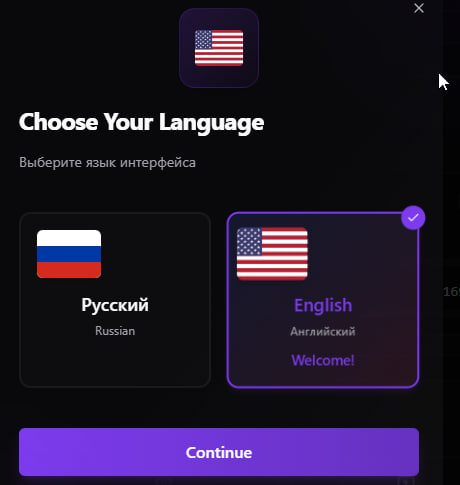
  <br>
  <em>Interface language selection on first launch</em>
</p>

### ✨ Visual Logic Editor (No-Code)
- **Drag-and-Drop interface** for creating complex logic without code
- **Live Debug mode** with breakpoints and step-by-step execution
- **Execution tracing** with history and variable values
- **Collaborative editing** of graphs by multiple users

### 🤖 Comprehensive Bot Management
- **Start/stop/restart** with one click
- **Interactive console** for each bot with history
- **Resource monitoring** (CPU/RAM) in real-time
- **3D Viewer** — see the world through bot's eyes in real-time
- **SOCKS5 proxy support** individually for each bot
- **Task scheduler** with cron schedules

<p align="center">
  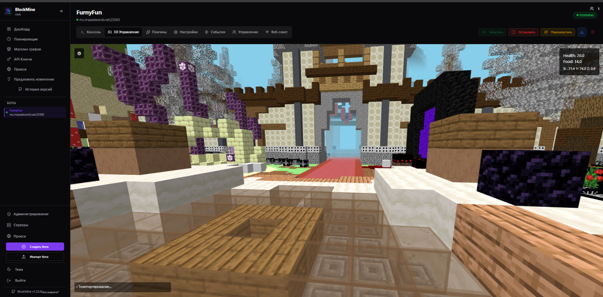
  <br>
  <em>Real-time 3D view of Minecraft world through bot's eyes</em>
</p>

### 🔌 Powerful Plugin System
- **Built-in store** with categories and search
- **Automatic dependency installation**
- **GUI configuration** without editing config files
- **Hot-reload** plugins without restarting the bot

### 🔐 Flexible Permission System
- **User groups** (Admin, Member, etc.)
- **Detailed access rights** for each command
- **User blacklist**
- **Cooldowns** and **aliases** for commands

### 🔄 Export and Import
- **Full bot backups** to ZIP archive
- **Export/import** individual commands and graphs
- **Transfer between BlockMine installations**

### 🔌 WebSocket API
- **Bot control** from external applications
- **Command execution** with full permission checking
- **Call visual graphs** and get results
- **Subscribe to events** (chat, players, health, etc.)
- **SDK** `blockmine-sdk` for Node.js ⚠️ *(alpha version, not a priority)*

<p align="center">
  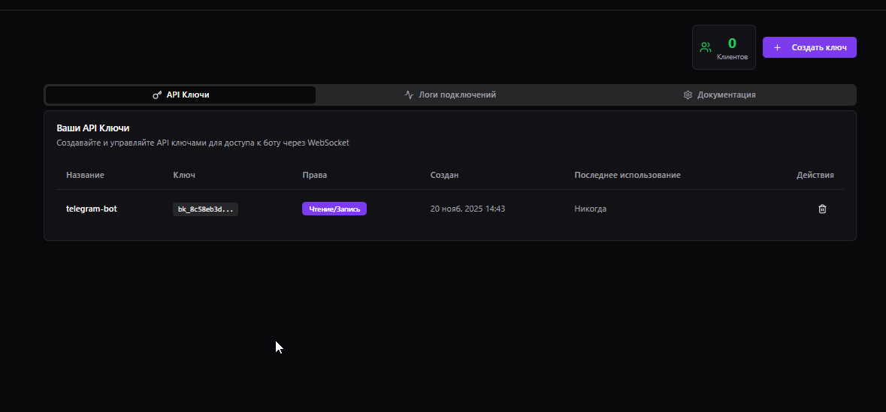
  <br>
  <em>Interactive panel for working with WebSocket API</em>
</p>

### 🤖 MCP Server (for AI assistants)
- **Built-in** [Model Context Protocol](https://modelcontextprotocol.io/) endpoint at `POST /api/mcp`
- **55 tools**: bots, servers, proxies, plugins, players and permissions, commands, chat, scheduler, plugin files on the host
- **Auth** via Panel API Key (`pk_*`) — same keys used by the WebSocket API
- **HTTP connection** — Cursor, Claude, and any client with HTTP MCP
- **`plugin-author` prompt** — full plugin-development guide served by the MCP itself, AI clients fetch it with a single `prompts/get`

---

## ✨ Quick Start with `npx`

This is the easiest way to run the panel locally. Make sure you have **Node.js v22+** installed.

1. Open terminal (command prompt)
2. Run a single command:

```bash
npx blockmine
```

3. Done! The script will automatically download everything needed, set up the database, and start the server.

> ⚠️ **For Windows users**: If you get an error `Cannot load file ... npx.ps1 because running scripts is disabled`, open PowerShell as administrator and run `Set-ExecutionPolicy RemoteSigned -Scope CurrentUser`. Press 'Y' to confirm.

After successful startup, you'll see in the console:
```
Control panel available at: http://localhost:3001
```
Open this address in your browser to get started.

---

## 🚀 Hosting Installation (VPS/Dedicated Server)

For production deployment on a server, it's recommended to use PM2 for process management.

### Requirements
- **Node.js v22+**
- **npm**
- **Git** (for cloning the repository)
- **PM2** (process manager)

### Step 1: Clone the Repository

```bash
git clone https://github.com/blockmineJS/blockmine.git
cd blockmine
```

### Step 2: Install Dependencies

```bash
npm install
```

> **Note**: The `npm install` command will automatically run the `postinstall` script, which installs frontend dependencies and generates the Prisma client.

### Step 3: Build Frontend

```bash
npm run build
```

This command will create an optimized production build of the React application.

### Step 4: Install PM2

If PM2 is not yet installed globally:

```bash
npm install -g pm2
```

### Step 5: Start with PM2

Launch the application using the ready-made configuration file:

```bash
pm2 start ecosystem.config.js
```

> **Note**: The project already includes an `ecosystem.config.js` file with optimal production settings.

### Updating

To update to the latest version: ON HOST! For local you can skip build since it uses port 5173

```bash
cd blockmine
git pull
npm install
npm run build
pm2 restart blockmine
```

---

## 💡 Core BlockMine Concepts

### 🎨 Visual Editor

<p align="center">
  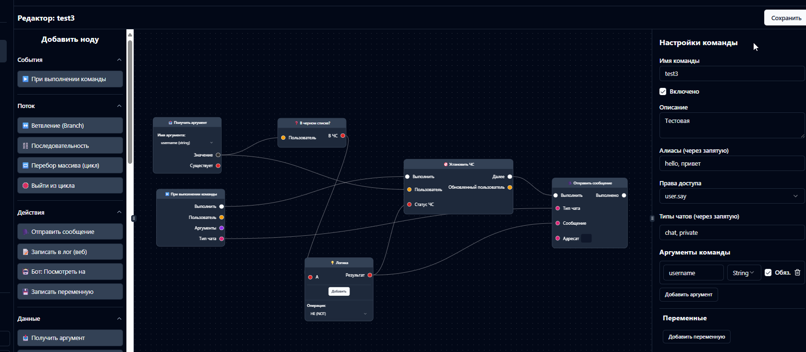
</p>

The heart of No-Code automation in BlockMine. The editor allows you to create logic by dragging and connecting functional blocks (nodes).

#### Editor Features:
- **Create commands** with arguments, permission checks, and complex logic
- **Handle events** (player join, chat messages, mob spawns)
- **Live Debug** - real-time debugging with breakpoints
- **Trace Viewer** - view execution history with variable values
- **Collaborative work** - multiple developers can edit simultaneously

### 🔍 Debugging System

BlockMine provides two powerful debugging systems:

#### Live Debug
- **Breakpoints** - stop execution at specific nodes
- **Conditional breakpoints** - trigger when condition is met
- **Step-by-step execution** - Step Over for detailed analysis
- **What-If mode** - modify values during pause
- **Multi-user synchronization** - everyone sees the same debug state
<td align="center">
      <p><strong>🎨 Visual Editor with Live Debug</strong></p>
      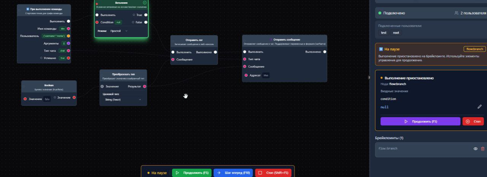
      <em>Real-time graph debugging with breakpoints and step-by-step execution</em>
    </td>

#### Trace Viewer
- **Execution history** - saving all graph runs
- **Variable values** - view inputs/outputs of each node
- **Playback** - step-by-step execution review
- **Timeline** - visualization of node execution order
<tr>
    <td align="center">
      <p><strong>🔍 Execution Tracing</strong></p>
      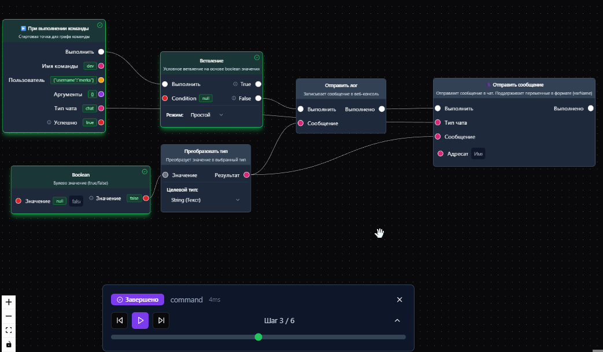
      <em>Step-by-step graph execution visualization with history and variable values</em>
    </td>
  </tr>


### 🔌 Plugins

<p align="center">
  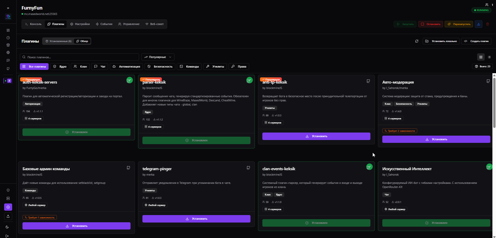
  <br>
  <em>Built-in plugin store with categories, search, and automatic dependency installation</em>
</p>

Plugins are a way to programmatically extend functionality. They can:
- Add new commands
- Create new nodes for the visual editor
- Work in background mode
- Integrate with external services

#### Plugin Store Features
- **Categories** - filter by purpose (Core, Clan, Utilities, etc.)
- **Automatic installation** - dependencies are installed automatically
- **GUI configuration** - without editing config files
- **Updates** - check and install updates

### ⚙️ Commands

Commands can be created in two ways:

#### Programmatic Commands (via plugins)
```javascript
bot.registerCommand({
  name: 'ping',
  description: 'Connection check',
  execute: async (context) => {
    return `Pong, ${context.user.username}!`;
  }
});
```

#### Visual Commands (via editor)
- **Drag-and-Drop** logic creation
- **Arguments** - define types and default values
- **Conditions** - check permissions, time of day, etc.
- **Loops and branching** - complex logic without code

#### Centralized Management
- **Aliases** - short aliases (e.g., `@p` for `@ping`)
- **Cooldowns** - delay between uses
- **Allowed chats** - chat, local, clan, private
- **Enable/disable** - temporarily disable commands

### 🔐 Permissions and Groups

Flexible access control system:

#### Permissions
- Each action is protected by a permission (e.g., `user.fly`)
- Permissions are created by plugins or in the control panel
- Detailed access control

#### Groups
- Combining multiple permissions
- Preset groups: Admin, Member
- Create custom groups

#### Users
- Automatically added when interacting with the bot
- Assign to groups
- Blacklist for blocking

### ⏰ Task Scheduler

Automate bot actions on schedule:
- **Cron expressions** - flexible time configuration
- **Actions** - start/restart bot, execute commands
- **Run history** - view recent executions
- **Enable/disable** - temporarily deactivate tasks

---

## 🤖 MCP — drive BlockMine with AI assistants

BlockMine ships a **built-in MCP server** (Model Context Protocol) on `POST /api/mcp`. Any MCP-compatible AI client — Claude Desktop, Cursor, Cline, Claude Code — can manage your bots, author plugins, read settings and logs through a normal chat with the AI.

### What the AI gets through MCP

- **Bots:** `list_bots`, `get_bot`, `get_bot_states`, `get_bot_live_state`, `create_bot`, `update_bot`, `delete_bot`, `start_bot`, `stop_bot`, `restart_bot`, `send_message_to_bot`, `get_chat_history`, `get_bot_logs`
- **Servers and proxies:** `list_servers`, `create_server`, `update_server`, `delete_server`, `list_proxies`, `create_proxy`, `update_proxy`, `delete_proxy`
- **Plugins:** `get_bot_plugins`, `get_plugin_settings`, `update_plugin_settings`, `enable_disable_plugin`, `list_plugin_catalog`, `get_catalog_plugin`, `install_plugin`, `install_local_plugin`, `uninstall_plugin`, `update_installed_plugin`, `check_plugin_updates`, `get_plugin_store`
- **Plugin files on the host:** `create_plugin`, `list_plugin_files`, `read_plugin_file`, `write_plugin_file`, `plugin_fs`, `reload_plugin`
- **Players, groups, and permissions:** `get_bot_users`, `get_user_info`, `set_player_blacklist`, `add_player_to_group`, `remove_player_from_group`, `get_bot_groups`, `create_bot_group`, `grant_group_permission`, `revoke_group_permission`, `get_bot_permissions`
- **Commands:** `get_bot_commands`, `update_bot_command`
- **Scheduler:** `list_tasks`, `create_task`, `update_task`, `delete_task`
- **`plugin-author` prompt** — the full BlockMine plugin-development guide, served by MCP and fetched by the AI with a single `prompts/get`

`send_message_to_bot` takes a chat type (`chat`, `private`, `command`, or a type registered by a plugin) and can wait for the chat reply.

### Setup

#### 1. Get a Panel API Key

In the BlockMine panel: **Settings → API Keys → Create key**. The key starts with `pk_`.

#### 2. Connect the client over HTTP

```bash
claude mcp add blockmine --scope user --transport http \
  http://localhost:3001/api/mcp \
  --header "Authorization: Bearer pk_your_key"
```

Or in `mcp.json`:
```json
{
  "mcpServers": {
    "blockmine": {
      "type": "http",
      "url": "http://localhost:3001/api/mcp",
      "headers": { "Authorization": "Bearer pk_your_key" }
    }
  }
}
```

### Remote hosting

The MCP endpoint comes up together with the panel. If BlockMine runs on a VPS, just use its public URL instead of `localhost:3001`. Auth is per-request via `Authorization: Bearer pk_*` — same keys as the WebSocket API.

---

## 🧑‍💻 For Developers and Contributors

> **🤖 For AI Agents:** If you are an AI agent connected via MCP, you already have the `plugin-author` prompt (call `prompts/get` with that name). Without MCP, see [docs/plugin-author.md](./docs/plugin-author.md).

If you want to contribute to the project or run it in development mode.

### Requirements
- **Node.js v22+**
- **npm** or **yarn**

### 1. Installation

```bash
git clone https://github.com/blockmineJS/blockmine.git
cd blockmine
npm install
npm run build
```

### 2. Running in Development Mode

This command will simultaneously start the backend (`nodemon`) and frontend (`vite`) with hot reloading.

```bash
npm run dev
```

- **Backend** will be available at `http://localhost:3001`
- **Frontend** with hot reloading will be available at `http://localhost:5173`


## Screenshots

Captured from the v1.27.1 panel.

<table align="center">
  <tr>
    <td align="center">
      <p><strong>Dashboard</strong></p>
      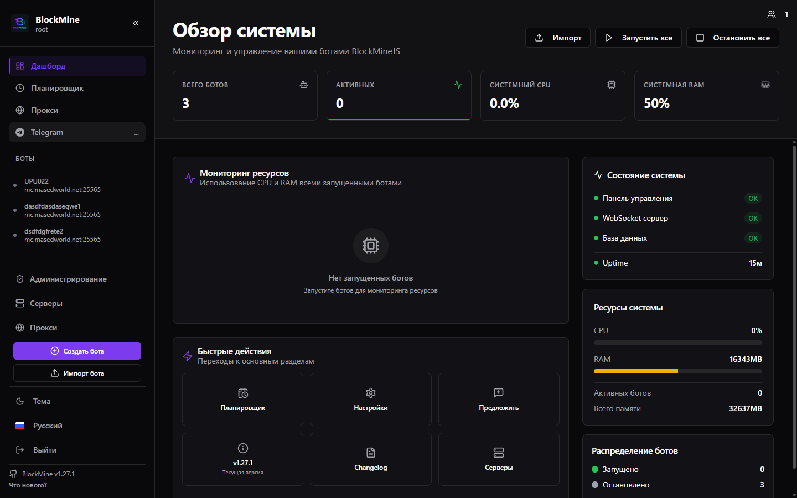
      <em>Bot status, CPU and RAM</em>
    </td>
  </tr>
  <tr>
    <td align="center">
      <p><strong>Plugin catalog</strong></p>
      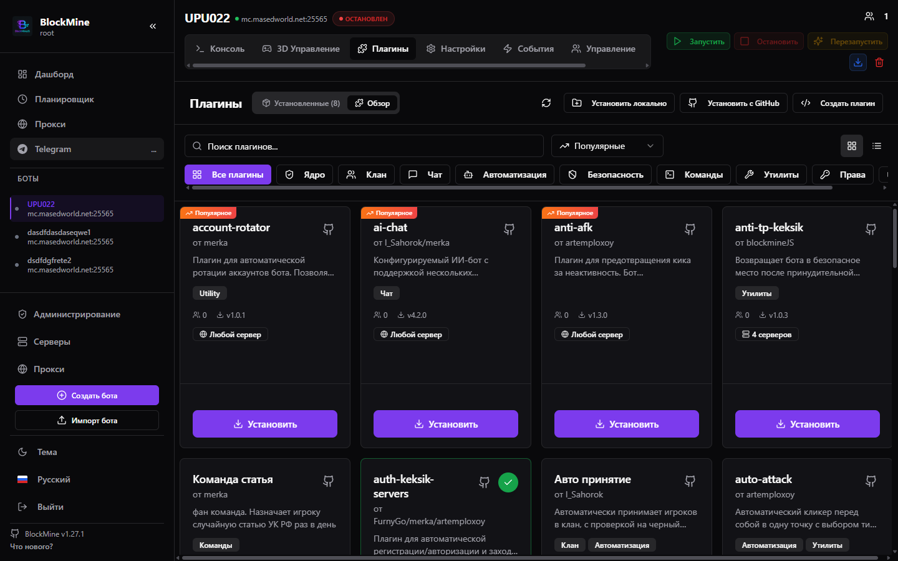
      <em>Install from the catalog, GitHub, or a local folder</em>
    </td>
  </tr>
  <tr>
    <td align="center">
      <p><strong>Installed plugins</strong></p>
      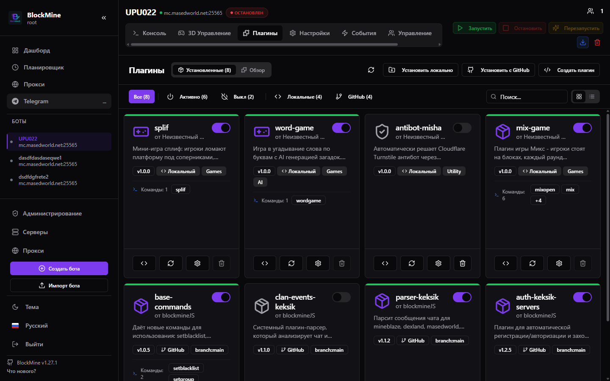
      <em>Enable, configure, and see the commands a plugin adds</em>
    </td>
  </tr>
  <tr>
    <td align="center">
      <p><strong>Plugin editor</strong></p>
      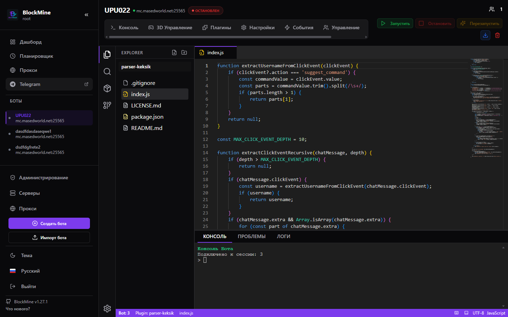
      <em>Files, Monaco and a terminal on the machine that runs the panel</em>
    </td>
  </tr>
  <tr>
    <td align="center">
      <p><strong>Commands</strong></p>
      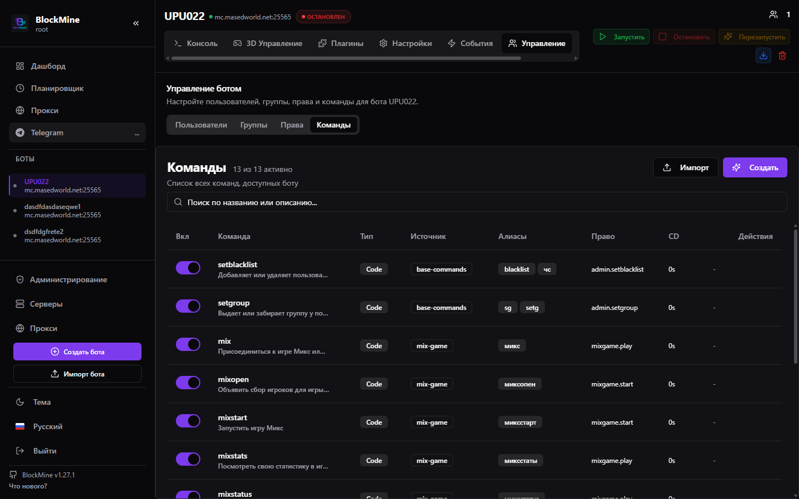
      <em>Aliases, permissions and where each command comes from</em>
    </td>
  </tr>
  <tr>
    <td align="center">
      <p><strong>3D view</strong></p>
      
      <em>The world through the bot, once it is online</em>
    </td>
  </tr>
  <tr>
    <td align="center">
      <p><strong>Graph debug</strong></p>
      
      <em>A breakpoint and the values on the nodes</em>
    </td>
  </tr>
</table>

---

---

## 🤝 Contributing

We welcome your contributions! Here's how you can help:

1. **Fork** the repository
2. Create a branch for your feature (`git checkout -b feature/amazing-feature`)
3. Commit your changes (`git commit -m 'feat: add amazing feature'`)
4. Push to the branch (`git push origin feature/amazing-feature`)
5. Open a **Pull Request**

### Commit Style

We use [Conventional Commits](https://www.conventionalcommits.org/):
- `feat:` - new functionality
- `fix:` - bug fix
- `docs:` - documentation changes
- `chore:` - routine tasks (updating dependencies, etc.)

---

---

<div align="center">
  <p>
    <a href="https://github.com/blockmineJS/blockmine">⭐ Star us on GitHub</a>
  </p>
</div>
