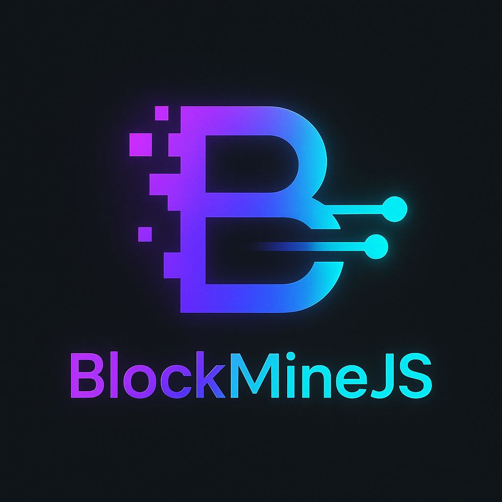
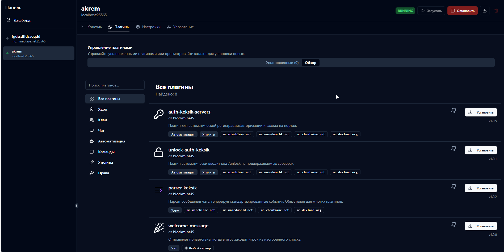
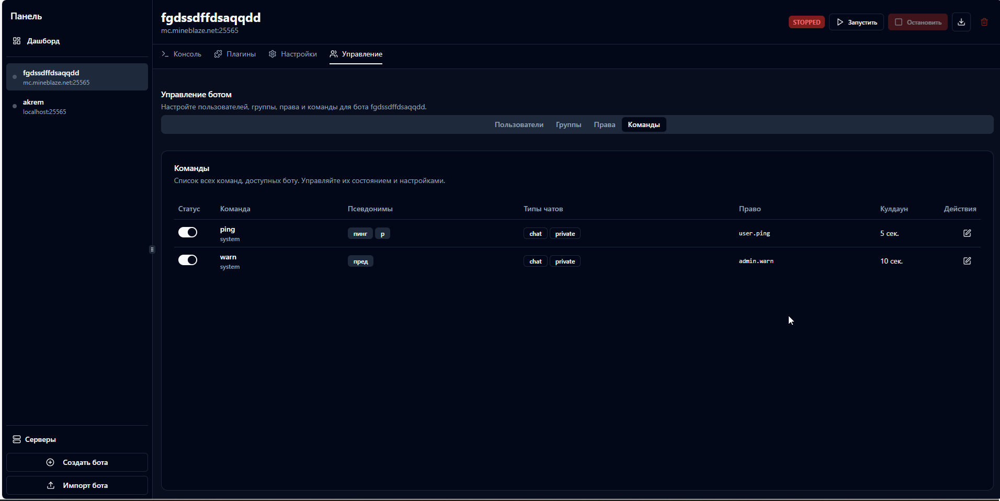
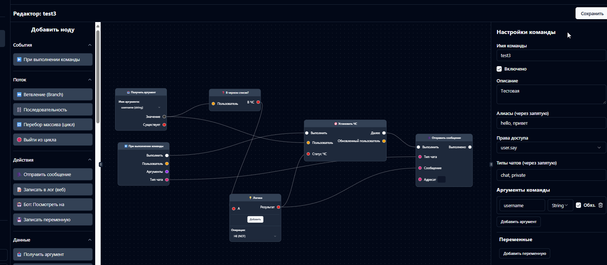

<div align="center">
  
  <h1>BlockMine</h1>
  <p>
    <strong>Мощная и удобная панель управления для ваших Minecraft-ботов на базе Mineflayer.</strong>
  </p>
  <p>
    <a href="https://github.com/blockmineJS/blockmine/stargazers"></a>
    <a href="https://github.com/blockmineJS/blockmine/commits/main"></a>
    <a href="http://185.65.200.184:3000/api/stats" target="_blank">
      
    </a>
  </p>
</div>

**BlockMine** — это open-source решение для централизованного управления и автоматизации ботов Minecraft. Запускайте ботов, управляйте ими в реальном времени, расширяйте их возможности с помощью плагинов и создавайте сложные сценарии поведения в визуальном редакторе.

---

<table align="center">
  <tr>
    <td align="center">
      <p><strong>Дашборд</strong></p>
      
      <em>Общая сводка и быстрое управление всеми ботами.</em>
    </td>
    <td align="center">
      <p><strong>Магазин плагинов</strong></p>
      
      <em>Расширяйте возможности с помощью удобного браузера плагинов.</em>
    </td>
    <td align="center">
      <p><strong>Управление командами</strong></p>
      
      <em>Настраивайте права, алиасы и кулдауны для каждой команды.</em>
    </td>
  </tr>
</table>

---

## 🚀 Ключевые возможности

*   **💻 Современный веб-интерфейс**: Адаптивная панель на React и Tailwind CSS для управления ботами, серверами и плагинами с любого устройства.
*   **✨ Визуальный редактор логики (No-Code)**: Проектируйте поведение ботов с помощью интуитивного Drag-and-Drop интерфейса. Создавайте сложные команды и обработчики событий, не написав ни строчки кода.
*   **🤖 Комплексное управление ботами**:
    *   Запуск, остановка и перезапуск ботов в один клик.
    *   Интерактивная консоль для каждого бота.
    *   Мониторинг ресурсов (CPU/RAM) в реальном времени.
    *   Поддержка SOCKS5-прокси для каждого бота индивидуально.
*   **🔌 Мощная система плагинов**:
    *   Расширяйте функциональность с помощью плагинов.
    *   Встроенный **браузер плагинов** с категориями и поиском.
    *   Автоматическая проверка и установка зависимостей.
    *   Настройка плагинов через графический интерфейс.
*   **🔐 Гибкая система прав (Permissions)**:
    *   Создавайте группы пользователей (`Admin`, `Member` и др.).
    *   Настраивайте детальные права доступа к каждой команде.
    *   Черный список для пользователей.
*   **🔄 Экспорт и импорт**:
    *   Создавайте **полные резервные копии** ботов в один ZIP-архив, включая все плагины и их настройки.
    *   Делитесь отдельными командами и графами событий через экспорт в JSON.
    *   Легко переносите ботов и их логику между разными установками BlockMine.
*   **📦 Простая установка**: Запуск всей системы одной командой благодаря `npx`.

## ✨ Быстрый старт с `npx`

Это самый простой способ запустить панель. Убедитесь, что у вас установлен **Node.js v18+**.

1.  Откройте терминал (командную строку).
2.  Выполните одну команду:

    ```bash
    npx blockmine
    ```
3.  Готово! Скрипт автоматически скачает все необходимое, настроит базу данных и запустит сервер.

> ⚠️ **Для пользователей Windows**: Если появляется ошибка `Невозможно загрузить файл ... npx.ps1, так как выполнение сценариев отключено`, откройте PowerShell от имени администратора и выполните `Set-ExecutionPolicy RemoteSigned -Scope CurrentUser`. Нажмите 'Y' для подтверждения.

После успешного запуска вы увидите в консоли:
```
Панель управления доступна по адресу: http://localhost:3001
```
Откройте этот адрес в вашем браузере, чтобы начать работу.

---

## 💡 Основные концепции BlockMine

Чтобы максимально эффективно использовать панель, важно понимать её ключевые компоненты.

### 🎨 Визуальный редактор
<p align="center">
  
</p>
Это сердце No-Code автоматизации в BlockMine. Редактор позволяет вам создавать логику, перетаскивая и соединяя функциональные блоки (ноды).

*   **Создание команд**: Спроектируйте полноценную команду с аргументами, проверками прав и сложной логикой, не прикасаясь к коду.
*   **Обработка событий**: Создавайте ноды, которые реагируют на игровые события (например, вход игрока, сообщение в чате, появление моба) и выполняют заданные действия.

### 🔌 Плагины
Плагины — это способ программного расширения функциональности. Они могут добавлять новые команды, новые ноды для визуального редактора или работать в фоновом режиме.

*   **Магазин плагинов**: Встроенный браузер позволяет легко находить и устанавливать плагины в один клик.
*   **Зависимости**: Система автоматически определит и предложит установить плагины, необходимые для работы выбранного вами.
*   **Настройка**: Большинство плагинов можно настроить прямо в веб-интерфейсе.

### ⚙️ Команды
Команды могут быть созданы двумя способами: **программно** через плагины или **визуально** в редакторе. Независимо от способа создания, все команды управляются централизованно.

*   **Алиасы**: Назначайте командам короткие псевдонимы (например, `@p` для `@ping`).
*   **Кулдауны**: Устанавливайте задержку между использованиями команды.
*   **Включение/выключение**: Временно отключайте команды.
*   **Аргументы**: Задавайте аргументы для ваших визуальных команд, которые будут доступны внутри графа.

### 🔐 Права и Группы (Permissions)
Это гибкая система, позволяющая точно контролировать, кто и что может делать с вашим ботом.

*   **Права (Permissions)**: Каждое действие (например, использование команды `@fly`) защищено правом (`user.fly`). Права могут создаваться плагинами или в панели управления.
*   **Группы (Groups)**: Группы объединяют несколько прав. Например, группа `Member` может иметь право `member.say`.
*   **Пользователи**: Каждый игрок, взаимодействующий с ботом, становится пользователем в системе. Вы можете добавлять пользователей в разные группы, выдавая им соответствующие права.

## 🧑‍💻 Для разработчиков и контрибьюторов

Если вы хотите внести свой вклад в проект или запустить его в режиме разработки.

### 1. Установка

```bash
git clone https://github.com/blockmineJS/blockmine.git
cd blockmine
npm install
```

### 2. Запуск в режиме разработки

Эта команда одновременно запустит бэкенд (`nodemon`) и фронтенд (`vite`) с горячей перезагрузкой.

```bash
npm run dev
```

*   **Бэкенд** будет доступен на `http://localhost:3001`.
*   **Фронтенд** с горячей перезагрузкой будет доступен на `http://localhost:5173`. Открывайте этот адрес для разработки.
