**🇷🇺 Русский** | [🇬🇧 English](./README.en.md)

---

<div align="center">
  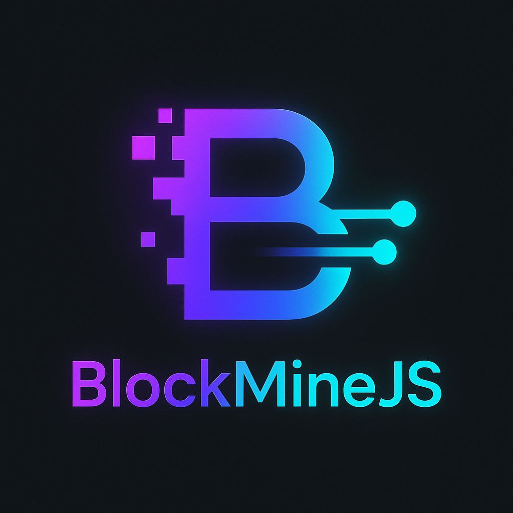
  <h1>BlockMine</h1>
  <p>
    <strong>Мощная платформа управления Minecraft-ботами с визуальным программированием и продвинутой отладкой</strong>
  </p>
  <p>
    <a href="https://github.com/blockmineJS/blockmine/stargazers"></a>
    <a href="https://github.com/blockmineJS/blockmine/commits/main"></a>
    <a href="http://185.65.200.184:3000/api/stats" target="_blank">
      
    </a>
  </p>
</div>

**BlockMine** — это open-source решение для централизованного управления и автоматизации ботов Minecraft. Запускайте ботов, управляйте ими в реальном времени, расширяйте их возможности с помощью плагинов и создавайте сложные сценарии поведения в визуальном редакторе.


Больше примеров на - https://t.me/blockmineJs

---


## 🚀 Ключевые возможности

### 💻 Современный веб-интерфейс
- **Адаптивная панель** на React и Tailwind CSS для управления с любого устройства
- **Темная тема** с современным дизайном
- **Real-time обновления** через WebSocket
- **Мультиязычность** — поддержка русского и английского языков

<p align="center">
  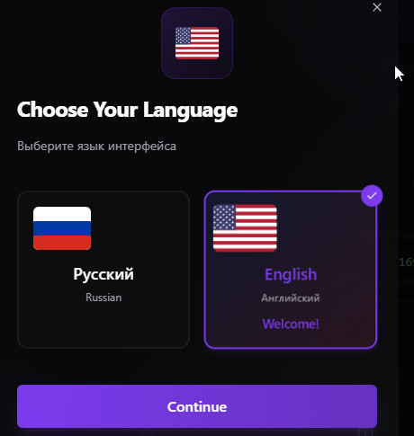
  <br>
  <em>Выбор языка интерфейса при первом запуске</em>
</p>

### ✨ Визуальный редактор логики (No-Code)
- **Drag-and-Drop интерфейс** для создания сложной логики без кода
- **Live Debug режим** с брейкпоинтами и пошаговым выполнением
- **Трассировка выполнения** с историей и значениями переменных
- **Совместное редактирование** графов несколькими пользователями
- **AI Ассистент** для помощи в создании логики

### 🤖 Комплексное управление ботами
- **Запуск/остановка/перезапуск** в один клик
- **Интерактивная консоль** для каждого бота с историей
- **Мониторинг ресурсов** (CPU/RAM) в реальном времени
- **3D Viewer** — просмотр мира глазами бота в реальном времени
- **Поддержка SOCKS5-прокси** индивидуально для каждого бота
- **Планировщик задач** с cron-расписаниями

<p align="center">
  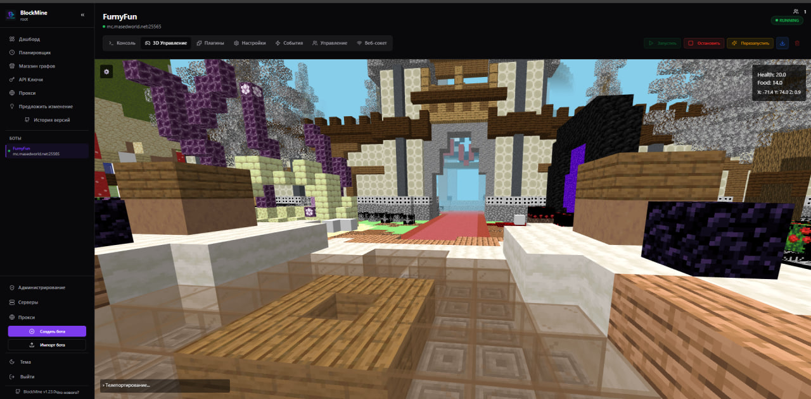
  <br>
  <em>3D просмотр мира Minecraft глазами бота в реальном времени</em>
</p>

### 🔌 Мощная система плагинов
- **Встроенный магазин** с категориями и поиском
- **Автоматическая установка зависимостей**
- **Настройка через GUI** без редактирования конфигов
- **Hot-reload** плагинов без перезапуска бота

### 🔐 Гибкая система прав
- **Группы пользователей** (Admin, Member и др.)
- **Детальные права доступа** для каждой команды
- **Черный список** пользователей
- **Кулдауны** и **алиасы** для команд

### 🔄 Экспорт и импорт
- **Полные резервные копии** ботов в ZIP-архив
- **Экспорт/импорт** отдельных команд и графов
- **Перенос между установками** BlockMine

### 🔌 WebSocket API
- **Управление ботами** из внешних приложений
- **Выполнение команд** с полной проверкой прав
- **Вызов визуальных графов** и получение результатов
- **Подписка на события** (чат, игроки, здоровье и др.)
- **SDK** `blockmine-sdk` для Node.js ⚠️ *(альфа-версия, не приоритет)*

<p align="center">
  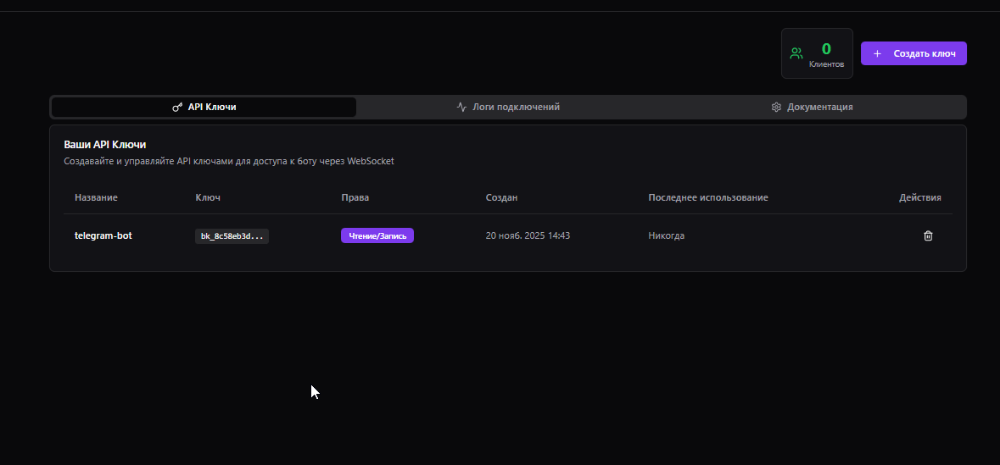
  <br>
  <em>Интерактивная панель для работы с WebSocket API</em>
</p>

### 🤖 MCP Server (для AI-ассистентов)
- **Встроенный** [Model Context Protocol](https://modelcontextprotocol.io/) endpoint на `POST /api/mcp`
- **25 tools**: управление ботами, плагины, пользователи/группы/права, чтение/запись файлов плагина прямо на хосте
- **Авторизация** через Panel API Key (`pk_*`) — те же ключи, что и для WebSocket API
- **Подключение из любого хоста** — Claude Desktop, Cursor, Cline, Claude Code и т.д.
- **`plugin-author` prompt** — полное руководство по разработке плагинов прямо в MCP, AI получает его одним вызовом `prompts/get`
- **npm-пакет [`blockmine-mcp`](https://www.npmjs.com/package/blockmine-mcp)** — тонкий stdio↔HTTP-мост для клиентов которые не умеют HTTP MCP

---

## ✨ Быстрый старт с `npx`

Это самый простой способ запустить панель локально. Убедитесь, что у вас установлен **Node.js v22+**.

1. Откройте терминал (командную строку)
2. Выполните одну команду:

```bash
npx blockmine
```

3. Готово! Скрипт автоматически скачает все необходимое, настроит базу данных и запустит сервер.

> ⚠️ **Для пользователей Windows**: Если появляется ошибка `Невозможно загрузить файл ... npx.ps1, так как выполнение сценариев отключено`, откройте PowerShell от имени администратора и выполните `Set-ExecutionPolicy RemoteSigned -Scope CurrentUser`. Нажмите 'Y' для подтверждения.

После успешного запуска вы увидите в консоли:
```
Панель управления доступна по адресу: http://localhost:3001
```
Откройте этот адрес в вашем браузере, чтобы начать работу.

---

## 🚀 Установка на хостинг (VPS/Dedicated Server)

Для продакшн-развертывания на сервере рекомендуется использовать PM2 для управления процессом.

### Требования
- **Node.js v22+**
- **npm**
- **Git** (для клонирования репозитория)
- **PM2** (менеджер процессов)

### Шаг 1: Клонирование репозитория

```bash
git clone https://github.com/blockmineJS/blockmine.git
cd blockmine
```

### Шаг 2: Установка зависимостей

```bash
npm install
```

> **Примечание**: Команда `npm install` автоматически запустит `postinstall` скрипт, который установит зависимости frontend и сгенерирует Prisma клиент.

### Шаг 3: Сборка frontend

```bash
npm run build
```

Эта команда создаст оптимизированную production-сборку React приложения.

### Шаг 4: Установка PM2

Если PM2 еще не установлен глобально:

```bash
npm install -g pm2
```

### Шаг 5: Запуск с PM2

Запустите приложение с помощью готового конфигурационного файла:

```bash
pm2 start ecosystem.config.js
```

> **Примечание**: В проекте уже есть файл `ecosystem.config.js` с оптимальными настройками для production.


### Обновление

Для обновления до последней версии: НА ХОСТЕ! Для локального можно и без build. ибо там 5173

```bash
cd blockmine
git pull
npm install
npm run build
pm2 restart blockmine
```

---

## 💡 Основные концепции BlockMine

### 🎨 Визуальный редактор

<p align="center">
  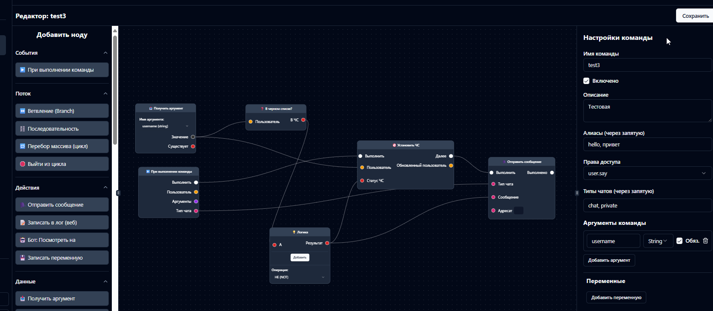
</p>

Сердце No-Code автоматизации в BlockMine. Редактор позволяет создавать логику, перетаскивая и соединяя функциональные блоки (ноды).

#### Возможности редактора:
- **Создание команд** с аргументами, проверками прав и сложной логикой
- **Обработка событий** (вход игрока, сообщения в чате, появление мобов)
- **Live Debug** - отладка в реальном времени с брейкпоинтами
- **Trace Viewer** - просмотр истории выполнения с значениями переменных
- **Совместная работа** - несколько разработчиков могут редактировать одновременно
- **AI ассистент** - помощь в создании логики

### 🔍 Система отладки

BlockMine предоставляет две мощные системы отладки:

#### Live Debug (Живая отладка)
- **Брейкпоинты** - остановка выполнения на конкретных нодах
- **Условные брейкпоинты** - срабатывание при выполнении условия
- **Пошаговое выполнение** - Step Over для детального анализа
- **What-If режим** - изменение значений во время паузы
- **Multi-user синхронизация** - все видят одно состояние отладки
<td align="center">
      <p><strong>🎨 Визуальный редактор с Live Debug</strong></p>
      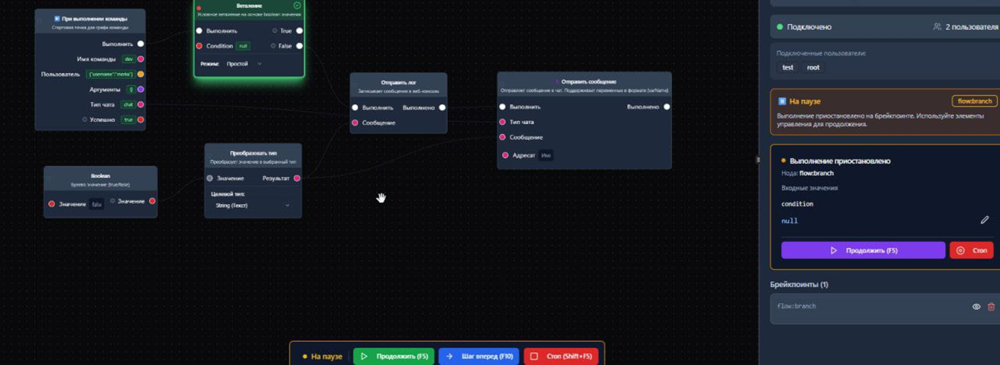
      <em>Отладка графов в реальном времени с брейкпоинтами и пошаговым выполнением</em>
    </td>

#### Trace Viewer (Просмотр трассировки)
- **История выполнения** - сохранение всех запусков графа
- **Значения переменных** - просмотр входов/выходов каждой ноды
- **Воспроизведение** - пошаговый просмотр выполнения
- **Временная шкала** - визуализация порядка выполнения нод
<tr>
    <td align="center">
      <p><strong>🔍 Трассировка выполнения</strong></p>
      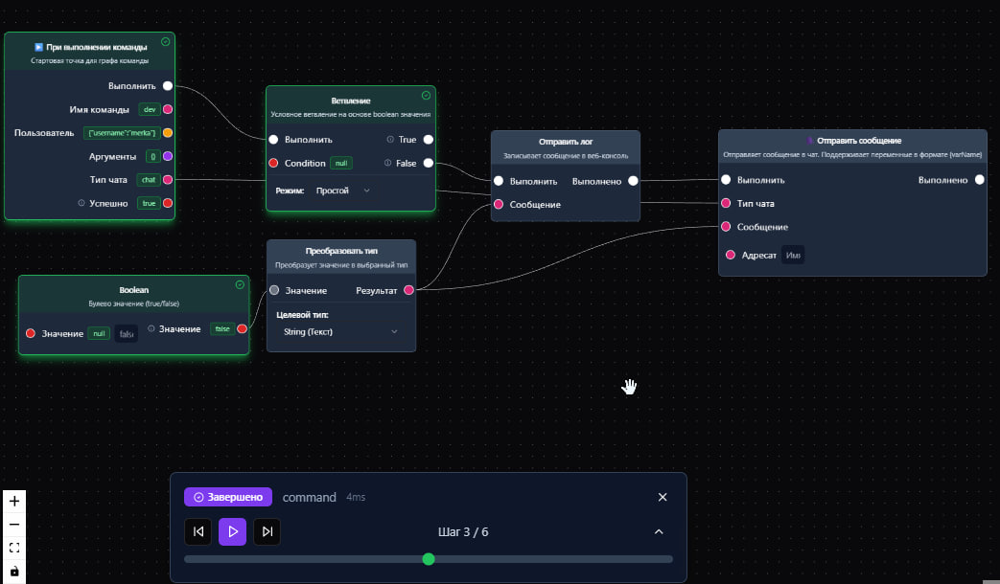
      <em>Пошаговая визуализация выполнения графа с историей и значениями переменных</em>
    </td>
  </tr>


### 🔌 Плагины

<p align="center">
  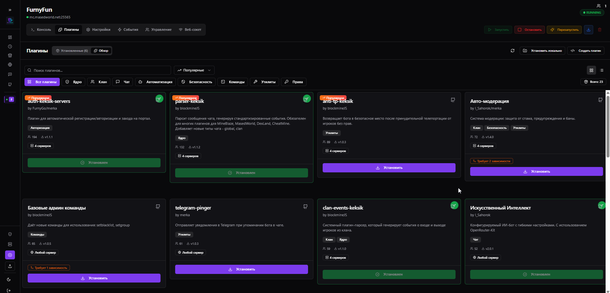
  <br>
  <em>Встроенный магазин плагинов с категориями, поиском и автоматической установкой зависимостей</em>
</p>

Плагины — это способ программного расширения функциональности. Они могут:
- Добавлять новые команды
- Создавать новые ноды для визуального редактора
- Работать в фоновом режиме
- Интегрироваться с внешними сервисами

#### Возможности магазина плагинов
- **Категории** - фильтрация по назначению (Ядро, Клан, Утилиты и др.)
- **Автоматическая установка** - зависимости устанавливаются автоматически
- **Настройка через GUI** - без редактирования конфигов
- **Обновления** - проверка и установка обновлений

### ⚙️ Команды

Команды могут быть созданы двумя способами:

#### Программные команды (через плагины)
```javascript
bot.registerCommand({
  name: 'ping',
  description: 'Проверка связи',
  execute: async (context) => {
    return `Понг, ${context.user.username}!`;
  }
});
```

#### Визуальные команды (через редактор)
- **Drag-and-Drop** создание логики
- **Аргументы** - определение типов и значений по умолчанию
- **Условия** - проверка прав, времени суток и др.
- **Циклы и ветвления** - сложная логика без кода

#### Централизованное управление
- **Алиасы** - короткие псевдонимы (например, `@p` для `@ping`)
- **Кулдауны** - задержка между использованиями
- **Разрешенные чаты** - chat, local, clan, private
- **Включение/выключение** - временное отключение команд

### 🔐 Права и Группы (Permissions)

Гибкая система контроля доступа:

#### Права (Permissions)
- Каждое действие защищено правом (например, `user.fly`)
- Права создаются плагинами или в панели управления
- Детальный контроль доступа

#### Группы (Groups)
- Объединение нескольких прав
- Предустановленные группы: Admin, Member
- Создание пользовательских групп

#### Пользователи
- Автоматическое добавление при взаимодействии с ботом
- Назначение в группы
- Черный список для блокировки

### ⏰ Планировщик задач

Автоматизируйте действия ботов по расписанию:
- **Cron-выражения** - гибкая настройка времени
- **Действия** - запуск/перезапуск бота, выполнение команд
- **История запусков** - просмотр последних выполнений
- **Включение/выключение** - временная деактивация задач

---

## MCP — управление через AI-ассистентов

BlockMine выставляет **встроенный MCP-сервер** (Model Context Protocol) на `POST /api/mcp`. Это значит, что любой MCP-совместимый AI-клиент — Claude Desktop, Cursor, Cline, Claude Code — может управлять твоими ботами, создавать плагины, читать настройки и логи через обычный диалог с AI.

### Что доступно AI через MCP

- **Боты:** `list_bots`, `get_bot_states`, `start_bot`, `stop_bot`, `restart_bot`, `send_message_to_bot`, `get_bot_logs`
- **Плагины:** `get_bot_plugins`, `get_plugin_settings`, `update_plugin_settings`, `enable_disable_plugin`, `install_local_plugin`
- **Разработка плагинов прямо на хосте:** `create_plugin`, `read_plugin_file`, `write_plugin_file`, `plugin_fs`, `reload_plugin`
- **Управление:** `get_bot_users`, `get_user_info`, `get_bot_groups`, `get_bot_permissions`, `get_bot_commands`
- **Промпт `plugin-author`** — полное руководство по разработке плагинов BlockMine, которое AI получает одной командой `prompts/get`

### Подключение

#### 1. Получить Panel API Key

В панели BlockMine: **Настройки → API ключи → Создать ключ**. Ключ начинается с `pk_`.

#### 2a. Через npm-обёртку (рекомендуется — работает в любом MCP-клиенте)

```bash
npx blockmine-mcp setup
```

Визард сам спросит URL панели и токен, проверит соединение и пропишет нужный конфиг в Claude Desktop / Claude Code / etc.

Вручную для Claude Code:
```bash
claude mcp add blockmine --scope user \
  -e BLOCKMINE_URL=http://localhost:3001 \
  -e BLOCKMINE_API_TOKEN=pk_ваш_ключ \
  -- npx -y blockmine-mcp
```

#### 2b. Напрямую по HTTP (для клиентов с нативной поддержкой HTTP MCP)

```bash
claude mcp add blockmine --scope user --transport http \
  http://localhost:3001/api/mcp \
  --header "Authorization: Bearer pk_ваш_ключ"
```

Или в `mcp.json`/`claude_desktop_config.json`:
```json
{
  "mcpServers": {
    "blockmine": {
      "type": "http",
      "url": "http://localhost:3001/api/mcp",
      "headers": { "Authorization": "Bearer pk_ваш_ключ" }
    }
  }
}
```

### Удалённое подключение

MCP endpoint поднимается вместе с самой панелью. Если BlockMine крутится на VPS — подставь публичный URL вместо `localhost:3001`. Авторизация per-request через `Authorization: Bearer pk_*` — те же ключи, что и для WebSocket API.

Подробнее об npm-пакете: [`blockmineJS/blockmine-mcp`](https://github.com/blockmineJS/blockmine-mcp).

---

## 🧑‍💻 Для разработчиков и контрибьюторов

> **🤖 Для AI агентов:** Если вы AI агент через MCP, у вас уже есть промпт `plugin-author` (вызовите `prompts/get` с этим именем). Если нет MCP — см. [backend/src/ai/plugin-assistant-system-prompt.md](./backend/src/ai/plugin-assistant-system-prompt.md).

Если вы хотите внести свой вклад в проект или запустить его в режиме разработки.

### Требования
- **Node.js v22+**
- **npm** или **yarn**

### 1. Установка

```bash
git clone https://github.com/blockmineJS/blockmine.git
cd blockmine
npm install
npm run build
```

### 2. Запуск в режиме разработки

Эта команда одновременно запустит бэкенд (`nodemon`) и фронтенд (`vite`) с горячей перезагрузкой.

```bash
npm run dev
```

- **Бэкенд** будет доступен на `http://localhost:3001`
- **Фронтенд** с горячей перезагрузкой будет доступен на `http://localhost:5173`


## 📸 Скриншоты

<table align="center">
  <tr>
    <td align="center">
      <p><strong>📊 Дашборд</strong></p>
      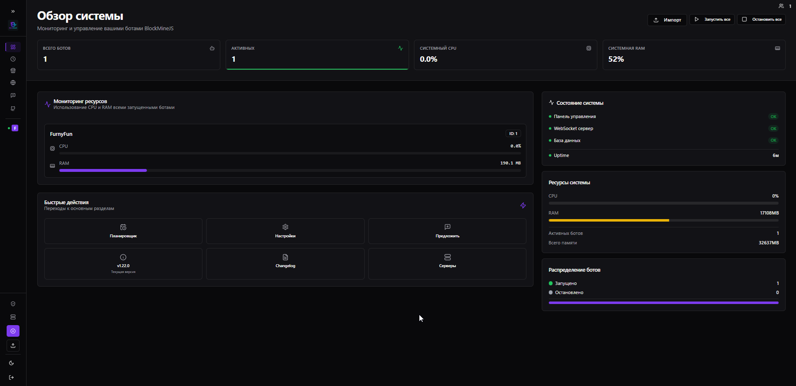
      <em>Мониторинг ресурсов и управление всеми ботами в реальном времени</em>
    </td>
  </tr>
  <tr>
    <td align="center">
      <p><strong>🌍 3D Viewer</strong></p>
      
      <em>Просмотр мира Minecraft глазами бота в реальном времени</em>
    </td>
  </tr>
  <tr>
    <td align="center">
      <p><strong>🔌 WebSocket API</strong></p>
      
      <em>Интерактивная панель для работы с WebSocket API</em>
    </td>
  </tr>
  <tr>
    <td align="center">
      <p><strong>👥 Совместная работа над графами</strong></p>
      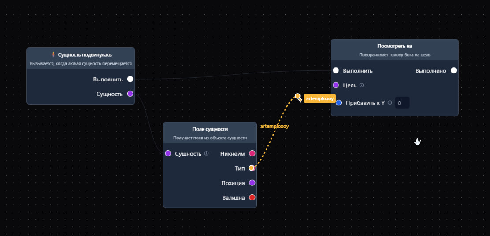
      <em>Несколько разработчиков могут работать над одним графом одновременно</em>
    </td>
  </tr>
  <tr>
    <td align="center">
      <p><strong>💻 Интерактивная консоль</strong></p>
      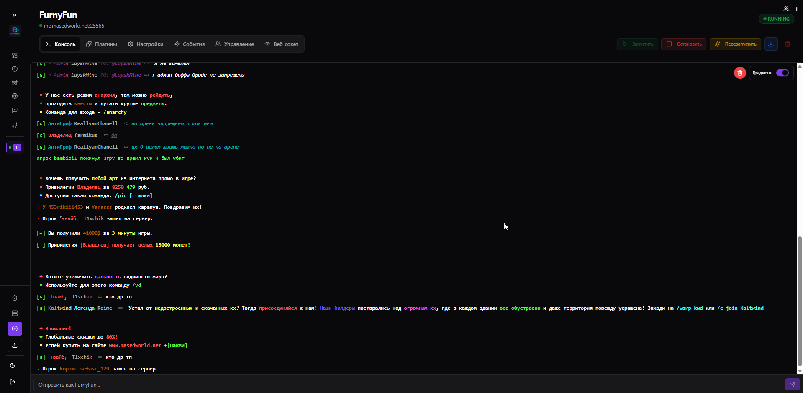
      <em>Полноценная консоль бота с цветной подсветкой и историей команд</em>
    </td>
  </tr>
  <tr>
    <td align="center">
      <p><strong>⚙️ Управление командами</strong></p>
      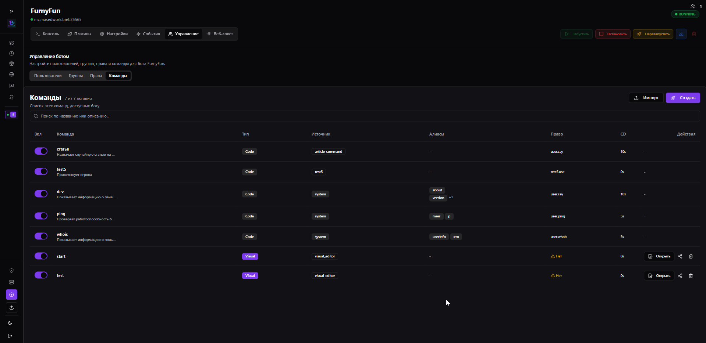
      <em>Централизованное управление командами с алиасами и правами доступа</em>
    </td>
  </tr>
  <tr>
    <td align="center">
      <p><strong>🎛️ Настройки команд</strong></p>
      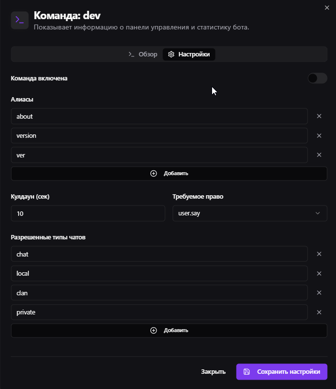
      <em>Гибкая настройка каждой команды: алиасы, кулдауны, права и разрешенные чаты</em>
    </td>
  </tr>
  <tr>
    <td align="center">
      <p><strong>⏰ Планировщик задач</strong></p>
      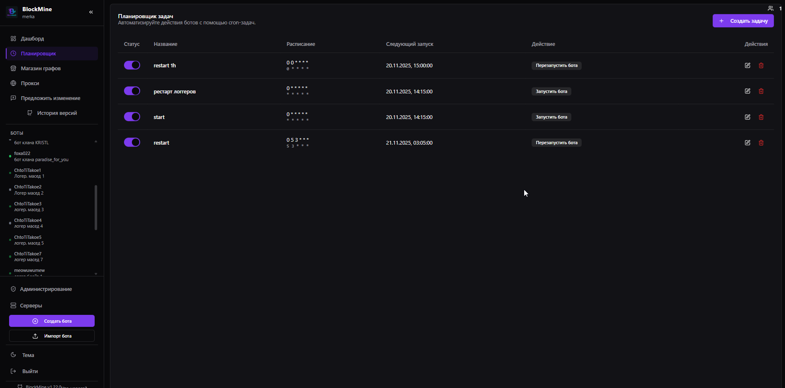
      <em>Автоматизируйте действия ботов с помощью cron-расписаний</em>
    </td>
  </tr>
</table>

---

---

## 🤝 Вклад в проект

Мы приветствуем ваш вклад! Вот как вы можете помочь:

1. **Fork** репозитория
2. Создайте ветку для вашей фичи (`git checkout -b feature/amazing-feature`)
3. Commit ваши изменения (`git commit -m 'feat: добавлена потрясающая фича'`)
4. Push в ветку (`git push origin feature/amazing-feature`)
5. Откройте **Pull Request**

### Стиль коммитов

Мы используем [Conventional Commits](https://www.conventionalcommits.org/):
- `feat:` - новая функциональность
- `fix:` - исправление бага
- `docs:` - изменения в документации
- `chore:` - рутинные задачи (обновление зависимостей и т.д.)

---

---

<div align="center">
  <p>
    <a href="https://github.com/blockmineJS/blockmine">⭐ Поставьте звезду на GitHub</a>
  </p>
</div>
