[🇷🇺 Русский](./README.ru.md) | **🇬🇧 English**

<div align="center">
  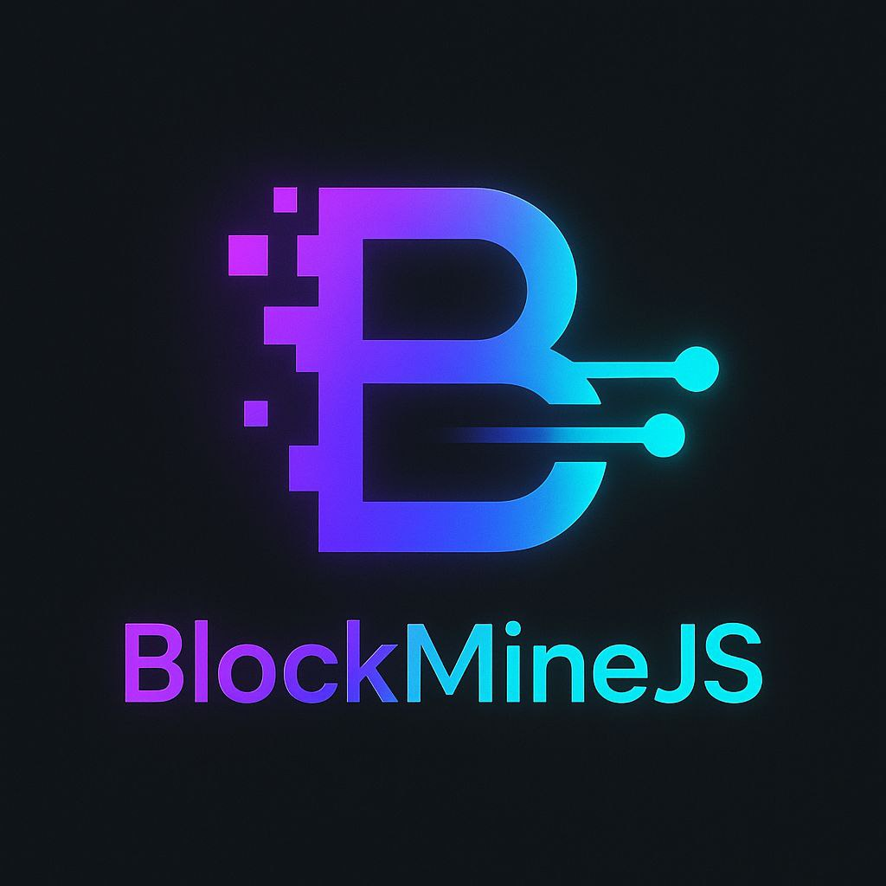

  <h1>BlockMine</h1>

  <p>
    <strong>Open-source Minecraft Bot Framework and Automation Platform</strong>
  </p>

  <p>
    Create and run Minecraft bots from a web panel,
    a visual editor, plugins, and an API. The low-level bot
    runtime is already there.
  </p>

  <p>
    <a href="https://github.com/blockmineJS/blockmine/stargazers"></a>
    <a href="https://github.com/blockmineJS/blockmine/commits/main"></a>
    <a href="http://212.22.78.42:3000/api/stats" target="_blank"></a>
  </p>
</div>

---

## What is BlockMine?

**BlockMine** is an open-source **Minecraft bot framework**, a **Minecraft automation platform**, and a web panel for creating and running Minecraft bots.

BlockMine is a ready-made environment for Minecraft automation. Bot management, commands, plugins, permissions, scheduling, debugging, and multi-account control are already in one panel.

BlockMine supports two ways to build behavior:

* **No-code.** Draw Minecraft bot behavior in the visual editor.
* **Code / low-code.** Write JavaScript plugins and your own nodes.

It fits simple AFK bots and server helpers, and it also fits heavier automation: clan bots, monitoring, server integrations, and AI-controlled Minecraft bots.

### What you can build

* Minecraft clan bots
* AFK bots
* Moderation bots
* Minecraft server monitoring
* Event logging
* Economy bots
* Farming and resource bots
* Server task automation
* Multi-account Minecraft automation
* Minecraft NPCs and assistants
* PvP and guard bots
* Integrations with outside services
* Discord and Telegram integrations
* Server testing
* AI-controlled Minecraft bots
* Custom Minecraft automation scripts

### Why BlockMine?

BlockMine puts these pieces in one system:

* Minecraft bot runtime
* Web dashboard
* Multi-bot management
* No-code visual scripting
* JavaScript plugins
* Custom visual nodes
* Plugin marketplace
* Permissions and groups
* Cron scheduler
* WebSocket API
* MCP server for AI assistants
* Live debugger
* Trace viewer
* 3D Minecraft world viewer
* SOCKS5 proxy support
* Hot reload

More examples: [https://t.me/blockmineJs](https://t.me/blockmineJs)

---

## BlockMine and Mineflayer

Mineflayer is the Minecraft bot API. BlockMine is the framework around it: the panel, several bots, plugins, visual scenarios, a debugger, the WebSocket API, and MCP are already included.

| Feature | Mineflayer | BlockMine |
|---|---|---|
| Minecraft bot API | ✅ | ✅ |
| Bot management | Manual | Built-in |
| Multiple bots | Manual | ✅ |
| Visual scripting | ❌ | ✅ |
| Plugin system | Via ecosystem | Built-in |
| Custom nodes | ❌ | ✅ |
| Web dashboard | Via plugins | Built-in |
| 3D viewer | Plugin | Built-in |
| Debugger | Manual | Built-in |
| Breakpoints | Manual | ✅ |
| Trace viewer | ❌ | ✅ |
| Permissions | Manual | Built-in |
| Cron scheduler | Manual | Built-in |
| WebSocket API | Manual | Built-in |
| MCP | ❌ | Built-in |
| Hot reload | Depends on setup | ✅ |

> **Looking for a Mineflayer alternative or a ready-made framework for building custom Minecraft bots?**
> BlockMine provides the bot runtime, web panel, plugin system, visual scripting, debugging, multi-bot management, WebSocket API and MCP integration out of the box.

---

## 🚀 Key features

### 🌐 Web panel

* **Responsive web panel** built with React and Tailwind CSS
* Works on desktop, tablet, and phone
* **Dark theme**
* **Real-time updates** over WebSocket
* **Two languages** — Russian and English
* Centralized Minecraft bot management

<p align="center">
  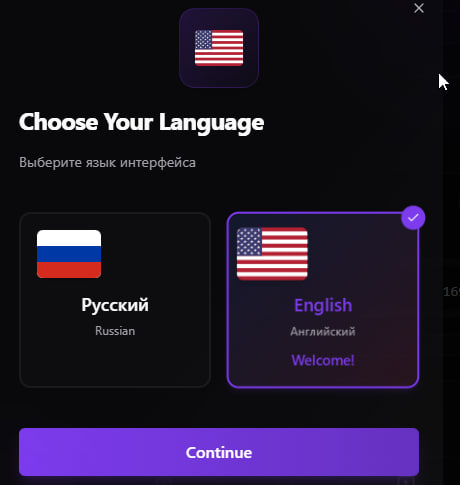
  <br>
  <em>Interface language selection on first launch</em>
</p>

### 🎨 Visual logic editor — no-code

Build complex Minecraft bot logic without writing code.

* **Drag-and-drop** interface
* Functional blocks (nodes)
* Chains of actions
* Commands
* Minecraft event handling
* Conditions, loops, and branches
* **Live debug** with breakpoints
* Step-by-step execution
* **Trace viewer**
* Execution history
* Variable values
* Several people can edit the same graph

### 🤖 Multi-bot management

Run several Minecraft bots from one panel.

* **Start, stop, and restart** in one click
* A separate interactive console for each bot
* Console history
* **Live CPU and RAM** monitoring
* **3D viewer** — see the Minecraft world through the bot's eyes
* A **SOCKS5 proxy** per bot
* Task scheduler
* Centralized bot management

<p align="center">
  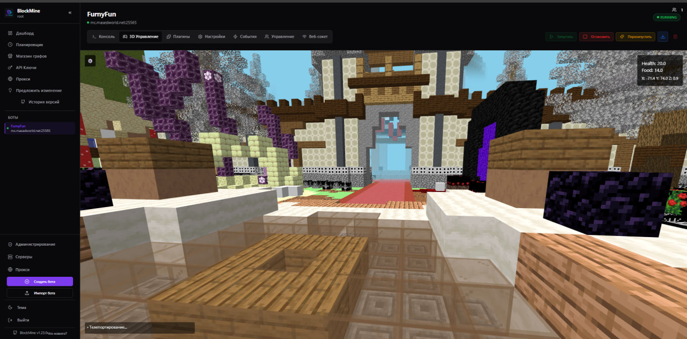
  <br>
  <em>Real-time 3D view of the Minecraft world through the bot's eyes</em>
</p>

### 🔌 Plugin system

Plugins extend BlockMine in code.

A plugin can:

* Add commands
* Add nodes for the visual editor
* Run in the background
* Talk to outside services
* Add custom Minecraft bot logic

#### Plugin marketplace

BlockMine includes a plugin catalog:

* **Categories** — Core, Clan, Utilities, and others
* **Search**
* **Automatic dependency installation**
* **GUI settings**
* **Update checks**
* Update installation
* Install from the catalog, GitHub, or a local source
* **Hot reload** without restarting the bot

<p align="center">
  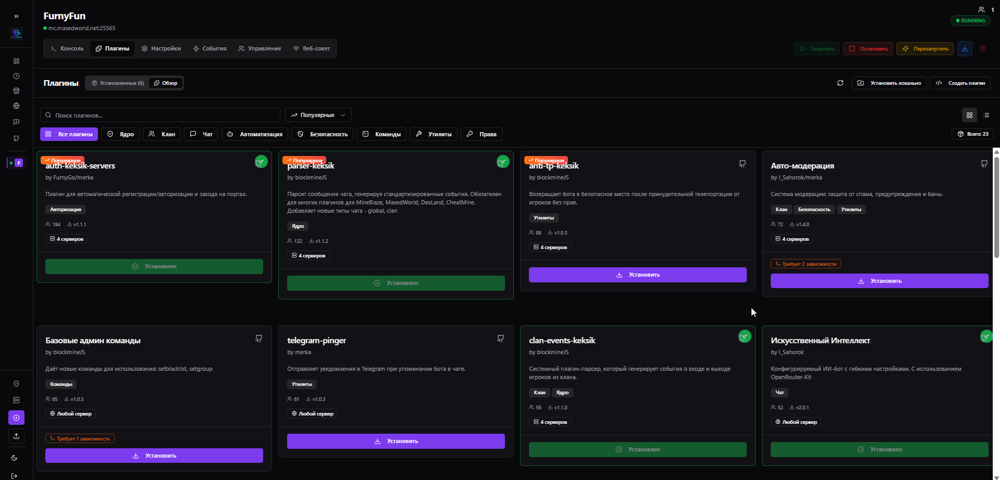
  <br>
  <em>Built-in plugin store with categories, search, and automatic dependency installation</em>
</p>

### 🔐 Permissions and groups

#### Permissions

* Each action can require its own permission
* Example: `user.fly`
* Plugins can declare permissions
* Permissions can also be created in the panel
* Fine-grained access control

#### Groups

* A group holds several permissions
* Built-in groups:

  * `Admin`
  * `Member`
* Custom groups

#### Users

* Users are added when they interact with the bot
* Assign users to groups
* User blacklist

#### Commands

* **Aliases**
* **Cooldowns**
* Allowed chat types
* Enable or disable a command

### 📦 Export / import

Move bots and their settings between BlockMine installs.

* Full bot backups as a **ZIP archive**
* Export and import individual commands
* Export and import graphs
* Move a setup from one BlockMine install to another

### 🔌 WebSocket API

The WebSocket API connects BlockMine to other applications.

The API can:

* Control bots
* Start and stop bots
* Run commands
* Call visual graphs
* Return execution results
* Subscribe to events
* Receive chat, player, health, and other events

Node.js SDK:

`blockmine-sdk`

> ⚠️ The SDK is alpha and is not a priority right now.

<p align="center">
  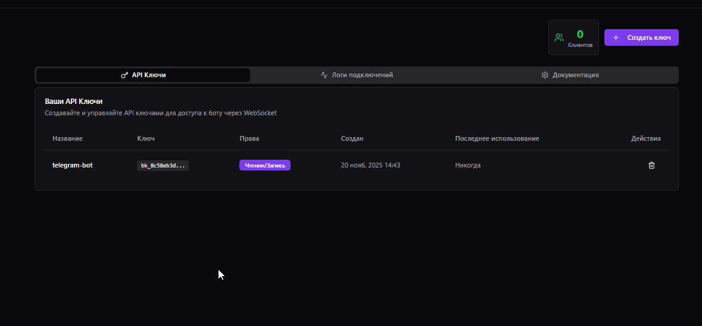
  <br>
  <em>Interactive panel for the WebSocket API</em>
</p>

---

# 🤖 MCP server — run Minecraft through an AI

BlockMine ships a built-in **Model Context Protocol (MCP)** server.

Endpoint:

```text
POST /api/mcp
```

Through MCP, an AI agent works with the BlockMine panel, bots, servers, plugins, files, commands, permissions, the scheduler, and the visual editor.

Clients:

* Claude Desktop
* Cursor
* Cline
* Claude Code
* any other MCP client

## One AI conversation, many jobs

The agent can run a full development and verification cycle.

For example:

1. **Read Minecraft server output.**

   * Chat
   * Private messages
   * Clan chat
   * Bot console

2. **Read what the server answered.**

3. **Create or edit a plugin.**

   * Commands
   * Event handlers
   * Settings
   * Extra functions

4. **Reload the plugin** without disconnecting the live bot from the Minecraft server.

5. **Check the result.**

   * Send a message in the right chat
   * Wait for the reply
   * Compare the reply with the log
   * Change the code if the reply is wrong

6. **Set up the surroundings.**

   * Permissions
   * Groups
   * Command settings
   * Cron tasks
   * Plugin installation
   * Server settings
   * Proxies

7. **Edit the open visual graph.**

MCP turns the panel into a place where an AI agent can **create, change, run, and check Minecraft automation**.

Edits to the open graph show up in the editor and **are not written to disk until the user saves the canvas**. The plugin guide is the `plugin-author` prompt.

---

# 🔑 Connect MCP

## 1. Create a panel API key

In the BlockMine panel:

**Settings → API keys → Create key**

The key starts with:

```text
pk_
```

## 2. Connect an MCP client over HTTP

Example:

```bash
claude mcp add blockmine --scope user --transport http \
  http://localhost:3001/api/mcp \
  --header "Authorization: Bearer pk_your_key"
```

### Or through `mcp.json`

```json
{
  "mcpServers": {
    "blockmine": {
      "type": "http",
      "url": "http://localhost:3001/api/mcp",
      "headers": {
        "Authorization": "Bearer pk_your_key"
      }
    }
  }
}
```

## Remote connection

The MCP endpoint starts with BlockMine.

If the panel runs on a VPS, replace:

```text
http://localhost:3001
```

with the public URL of that server.

Every request is authorized with:

```http
Authorization: Bearer pk_*
```

These are the same keys as the WebSocket API.

---

# 🚀 Quick start

## Requirements

A git install needs:

* **Git**
* **Node.js v22+**

On Windows, `start.bat` can install the Node.js LTS build through `winget` when Node.js is missing.

---

## Windows

### 1. Clone

```bash
git clone https://github.com/blockmineJS/blockmine.git
cd blockmine
```

### 2. Start with `start.bat`

From the project root:

```bat
start.bat
```

You can also double-click the file.

The script:

1. Checks for Node.js 22+
2. Installs the Node.js LTS build through `winget` if needed
3. Installs dependencies with `npm install`
4. Starts development mode with `npm run dev`
5. Starts the backend and Vite
6. Opens the panel

After startup:

* **Web panel:** [http://localhost:5173/](http://localhost:5173/)
* **API:** [http://localhost:3001](http://localhost:3001)

The first start can take a few minutes. Later starts are faster.

### Reinstall dependencies

```bat
start.bat reinstall
```

### Update by hand

```bat
update.bat
```

The script:

1. Stops the panel
2. Fetches new commits from GitHub
3. Installs dependencies
4. Builds the project
5. Starts the panel again

The **Update** button in the interface runs the same steps.

---

# 🐧 Linux and macOS

Install dependencies and start the project:

```bash
npm install
npm run dev
```

After startup:

* **Web panel:** [http://localhost:5173/](http://localhost:5173/)
* **API:** [http://localhost:3001](http://localhost:3001)

---

# 📦 Install with npm / npx

If Git cannot be installed:

```bash
npx blockmine
```

The command:

1. Downloads the package from npm
2. Sets up the database
3. Starts the server

The console prints:

```text
http://localhost:3001
```

> An `npx` install has no in-panel update button. A newer version means running `npx blockmine` again, and the package downloads in full.

### Windows and PowerShell

If you see:

```text
Cannot load file ... npx.ps1 because running scripts is disabled
```

open PowerShell as administrator and run:

```powershell
Set-ExecutionPolicy RemoteSigned -Scope CurrentUser
```

Press `Y` to confirm.

Or install BlockMine from Git and use:

```bat
start.bat
```

---

## Install on a host

If this is your first time on the host and you have no idea what to type, paste this. Ubuntu or Debian: it updates the system and installs Node.js 22, npm, and PM2.

```bash
sudo apt update && sudo apt upgrade -y
sudo apt install -y curl
curl -fsSL https://deb.nodesource.com/setup_22.x | sudo -E bash -
sudo apt install -y nodejs
sudo npm install -g npm@latest
sudo npm install -g pm2@latest
```

Then clone the repository:

```bash
git clone https://github.com/blockmineJS/blockmine.git
```

If it prints `-bash: git: command not found`, git is not on the host. Install it and run `git clone` again:

```bash
sudo apt install -y git
```

Then go into the folder, build the panel, and start it:

```bash
cd blockmine
npm i
npm run build
pm2 start
```

You can open it at `http://<host-ip>:3001`.

### Updating

On a PM2 host the panel can update itself: the **Update** button in the UI runs `git pull`, `npm install`, `npm run build`, and `pm2 restart`. Git fetches only new commits, so this is faster than installing the package again. That needs a git clone on `master`/`main` with a clean working tree.

The same steps by hand:

```bash
cd blockmine
git pull
npm install
npm run build
pm2 restart blockmine
```

Locally with `start.bat` / `npm run dev` you do not need a production build: Vite serves port 5173.

---

# 🧩 Core concepts

## 🎨 Visual node editor

The visual editor is the no-code side of BlockMine.

<p align="center">
  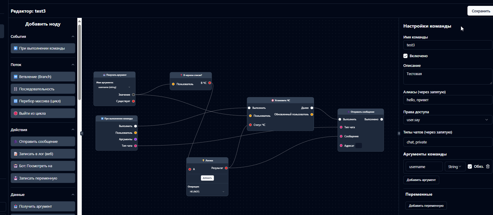
</p>

Logic is built by dragging and connecting functional blocks — **nodes**.

### What it can do

* Create commands
* Command arguments
* Permission checks
* Minecraft events
* Player join
* Chat messages
* Mob spawns
* Conditions
* Loops
* Branches
* Live debug
* Breakpoints
* Trace viewer
* Several people editing at once

---

# 🔍 Debugging

BlockMine has two debugging systems:

* **Live debug**
* **Trace viewer**

## Live debug

Debug a visual graph while it runs.

* **Breakpoints** — stop on a specific node
* **Conditional breakpoints** — stop when a condition is true
* **Step over** — run one step at a time
* **What-if** — change values while paused
* **Multi-user sync** — everyone sees the same debug state

<p align="center">
  <strong>🎨 Visual editor with live debug</strong><br>
  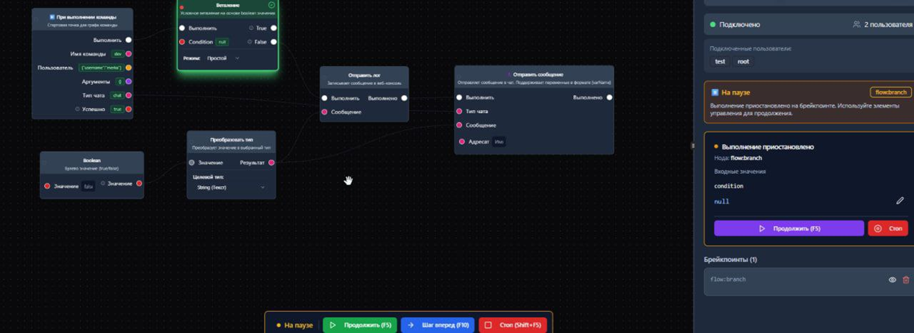
  <br>
  <em>Real-time graph debugging with breakpoints and step-by-step execution</em>
</p>

## Trace viewer

The trace viewer stores graph runs.

* **Execution history** — every run of the graph
* **Variable values** — inputs and outputs of each node
* **Replay** — step through a past run
* **Timeline** — the order in which nodes ran

<p align="center">
  <strong>🔍 Trace viewer</strong><br>
  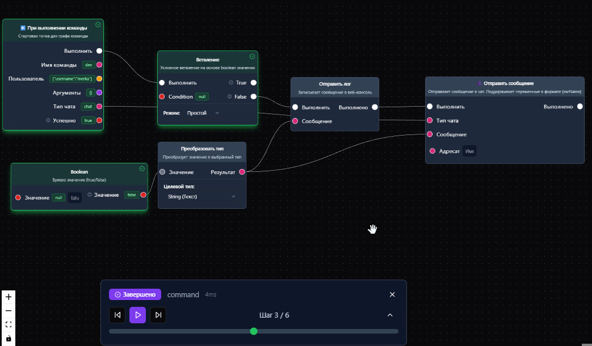
  <br>
  <em>Step-by-step graph execution with history and variable values</em>
</p>

---

# 🔌 Plugins

Plugins are how you extend BlockMine in code.

<p align="center">
  
  <br>
  <em>Built-in plugin store with categories, search, and automatic dependency installation</em>
</p>

Plugins can:

* Add commands
* Create visual nodes
* Run in the background
* Talk to outside services
* Extend Minecraft bots

## Plugin store

The catalog supports:

* Categories
* Filtering by purpose
* Search
* Automatic dependency installation
* GUI settings
* Update checks
* Installing updates

Example categories:

* Core
* Clan
* Utilities

---

# ⚙️ Commands

Commands can be created in two ways:

1. In code, through a plugin
2. Visually, in the node editor

## Commands in code

```javascript
bot.registerCommand({
  name: 'ping',
  description: 'Connection check',
  execute: async (context) => {
    return `Pong, ${context.user.username}!`;
  }
});
```

## Visual commands

The editor can build a command without programming.

It supports:

* **Drag and drop**
* Arguments
* Argument types
* Default values
* Conditions
* Permission checks
* Time-of-day checks
* Loops
* Branches

## Command management

Commands can have:

* **Aliases** — for example `@p` for `@ping`
* **Cooldowns**
* Allowed chat types:

  * `chat`
  * `local`
  * `clan`
  * `private`

  A plugin can add its own type. New message lines from the server arrive there, and the bot can send into it. A command can then be allowed only in that type.
* An on/off switch

---

# 🔐 Permissions and groups

BlockMine includes permissions and groups.

## Permissions

Each action can require its own permission:

```text
user.fly
```

Permissions can be:

* Declared by plugins
* Created in the panel
* Granted to groups
* Used for fine-grained access

## Groups

A group collects permissions.

Built-in groups:

```text
Admin
Member
```

You can create your own groups.

## Users

Users:

* Are added when they interact with the bot
* Can be placed in groups
* Can be blacklisted

---

# ⏰ Task scheduler

BlockMine can run actions on a schedule.

Schedules use **cron expressions**.

A task can:

* Start a bot
* Restart a bot
* Run commands
* Run other available actions

Each task has:

* A cron schedule
* A run history
* An on/off switch

---

# 🧑‍💻 For developers

BlockMine is also a platform for your own Minecraft automation plugins.

> **For AI agents:** if you are connected through MCP, load the `plugin-author` prompt with `prompts/get`. Without MCP, the full guide is in [docs/plugin-author.md](./docs/plugin-author.md).

## Requirements

* **Node.js v22+**
* **npm** or **yarn**

## Install

```bash
git clone https://github.com/blockmineJS/blockmine.git
cd blockmine
npm install
npm run build
```

On Windows:

```bat
start.bat
```

The script installs dependencies and starts development mode.

## Development mode

```bash
npm run dev
```

This starts:

* The backend with `nodemon`
* The frontend with `Vite`
* Hot reload

After startup:

* **Backend:** [http://localhost:3001](http://localhost:3001)
* **Frontend:** [http://localhost:5173](http://localhost:5173)

---

# 🖼️ Screenshots

## Dashboard

<p align="center">
  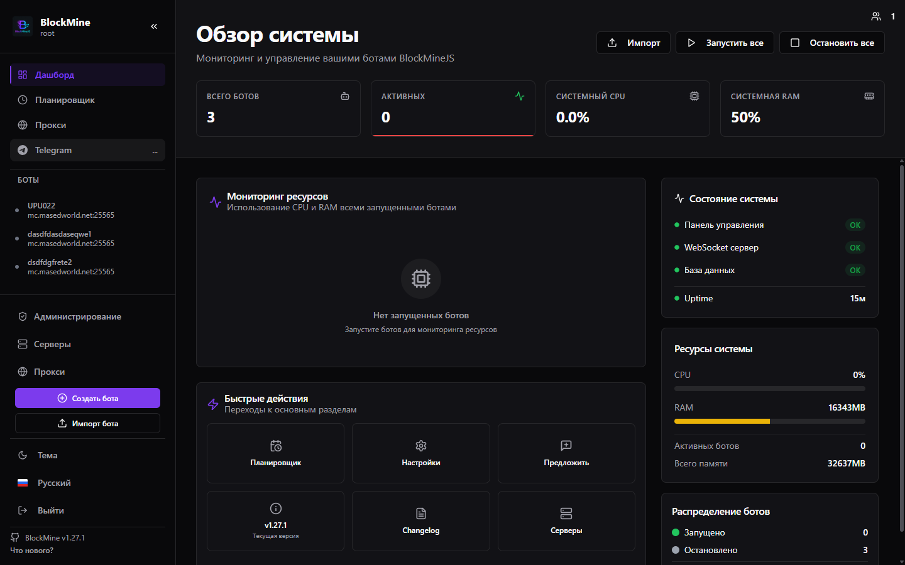
  <br>
  <em>Bot status, CPU, and RAM</em>
</p>

## Plugin store

<p align="center">
  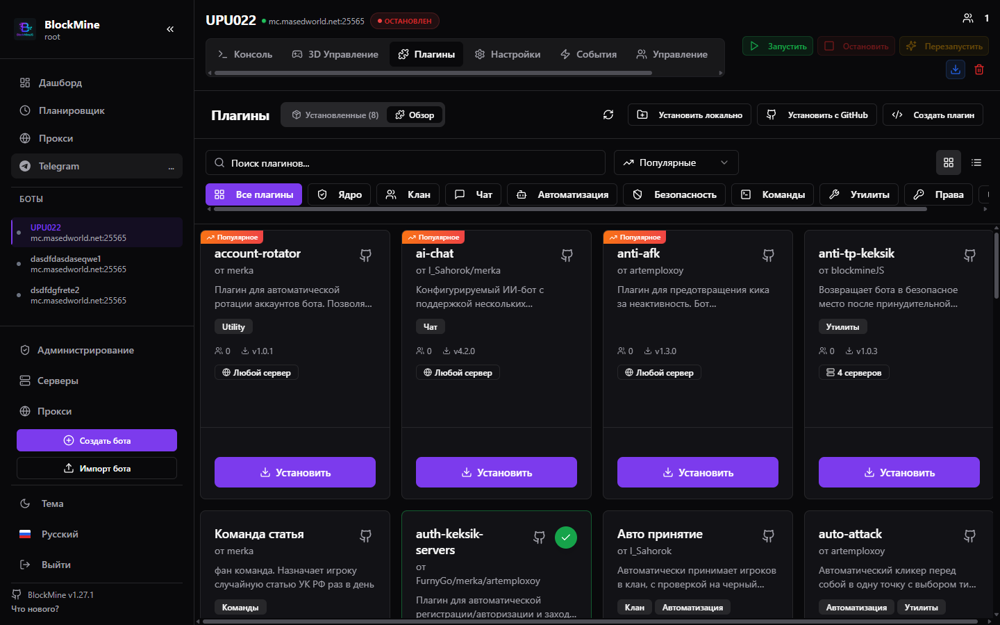
  <br>
  <em>Install from the catalog, GitHub, or a local file</em>
</p>

## Installed plugins

<p align="center">
  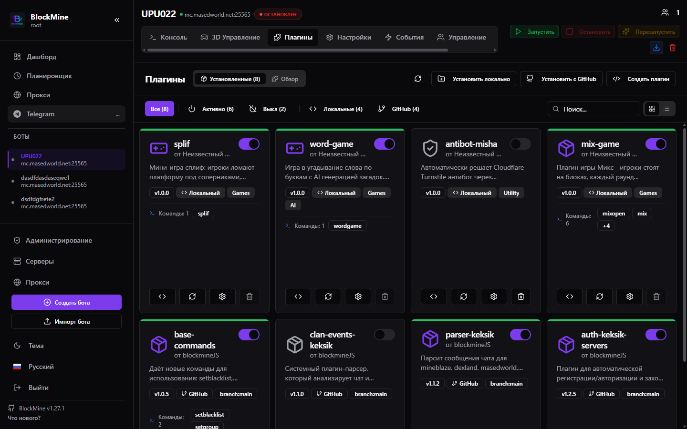
  <br>
  <em>Enable a plugin, edit its settings, and see its commands</em>
</p>

## Plugin editor

<p align="center">
  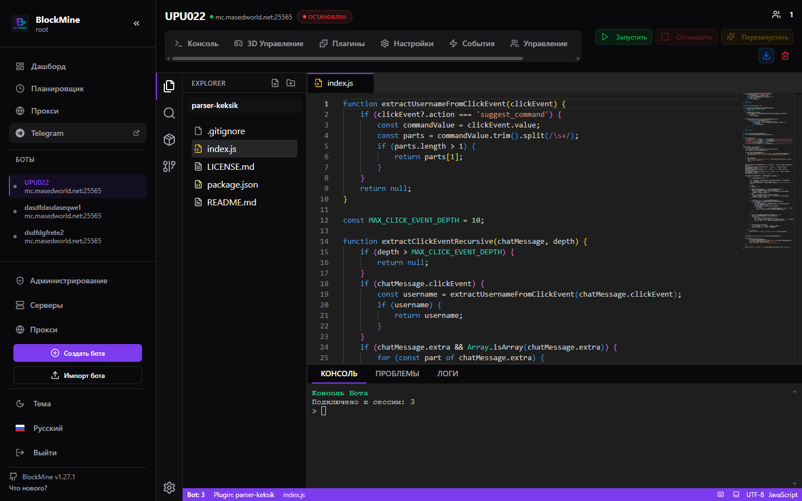
  <br>
  <em>Files, Monaco, and a terminal on the machine that runs the panel</em>
</p>

## Commands

<p align="center">
  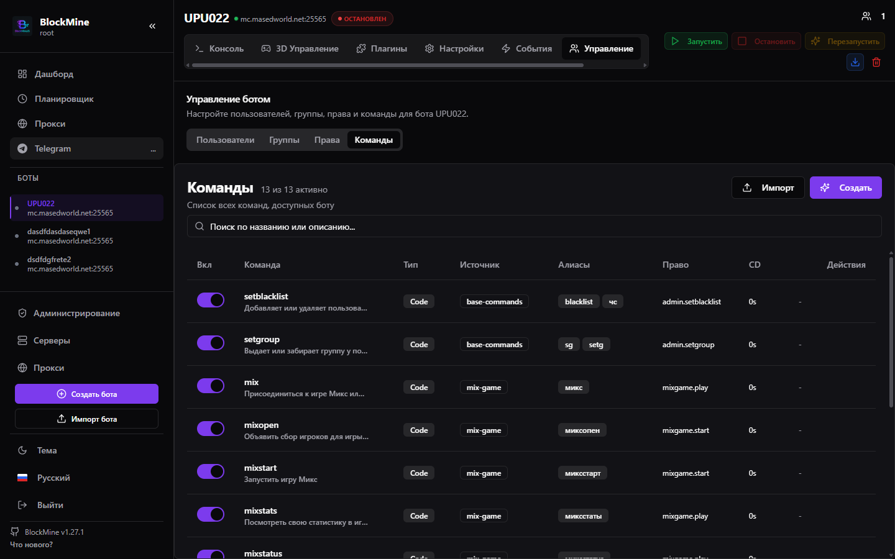
  <br>
  <em>Aliases, permissions, and where a command comes from</em>
</p>

## 3D viewer

<p align="center">
  
  <br>
  <em>The Minecraft world through the bot's eyes</em>
</p>

## Graph debugging

<p align="center">
  
  <br>
  <em>Breakpoints and node values</em>
</p>

---

# 🤝 Contributing

Contributions are welcome.

## How to contribute

1. **Fork** the repository
2. Create a branch:

```bash
git checkout -b feature/amazing-feature
```

3. Commit:

```bash
git commit -m "feat: add an amazing feature"
```

4. Push:

```bash
git push origin feature/amazing-feature
```

5. Open a **pull request**

## Commit style

This project uses [Conventional Commits](https://www.conventionalcommits.org/).

* `feat:` — a new feature
* `fix:` — a bug fix
* `docs:` — documentation
* `chore:` — routine work, such as dependency updates

---

# ⭐ BlockMine

**BlockMine is an open-source Minecraft bot framework and automation platform for creating, running, debugging, and managing Minecraft bots.**

If you are looking for:

* Minecraft bot framework
* Minecraft bot manager
* Minecraft automation framework
* Mineflayer-based bot platform
* Minecraft scripting platform
* No-code Minecraft bot builder
* Minecraft multi-bot manager
* Minecraft bot API
* Minecraft plugin system
* AI Minecraft bot platform
* MCP Minecraft automation

BlockMine brings those together in one platform.

<div align="center">
  <p>
    <a href="https://github.com/blockmineJS/blockmine">⭐ Star BlockMine on GitHub</a>
  </p>
</div>

---

## Keywords

```text
Minecraft bot
Minecraft bot framework
Minecraft automation
Minecraft automation framework
Minecraft bot manager
Minecraft bot platform
Minecraft bot API
Minecraft bot library
Minecraft scripting
Minecraft automation tool
Minecraft plugin system
Minecraft multi-bot
Minecraft AI bot
AI Minecraft bot
Minecraft MCP
Minecraft MCP server
Minecraft bot dashboard
Minecraft bot manager
Minecraft no-code
Minecraft visual scripting
Minecraft visual node editor
Mineflayer
Mineflayer bot
Mineflayer framework
Minecraft JavaScript bot
Minecraft Node.js bot
Minecraft server automation
Minecraft server bot
Minecraft clan bot
Minecraft AFK bot
Minecraft monitoring bot
Minecraft farming bot
Minecraft economy bot
Minecraft Discord bot
Minecraft Telegram bot
```
